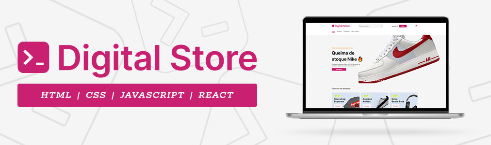

<p align="center">
    
    
    
    
    
    
    
</p>

# 📦 Digital Store

## 📢 Descrição do Projeto

### 🎯 Objetivo

<p align="left">
   Esse projeto foi criado como trabalho final de um curso de Full Stack utilizando ReactJS para a construção de componentes que possam ser aproveitados em diversas páginas..
<p align="left">
    <i>O projeto tem caráter experimental e visa a prática do conhecimento.</i>
</p>

### 📐 Estrutura de pastas
```
├── src/
│   ├── compoments/
│   │   ├── BuyBox
│   │   ├── Filter
│   │   ├── FilterGroup
│   │   ├── Footer
│   │   ├── Gallery
│   │   ├── Header
│   │   ├── InformationFooter
│   │   ├── Logo
│   │   ├── OrderBy
│   │   ├── ProductCard
│   │   ├── ProductDetails
│   │   ├── ProductGallery
│   │   ├── ProductListing
│   │   ├── ProductOptions
│   │   └── Section
│   └── pages/
│       ├── Category
│       ├── HomePage
│       ├── NotFound
│       ├── Pedidos
│       ├── ProductListingPage
│       └── ProductViewPage
├── App.css
├── App.jsx
├── index.css
└── main.jsx
```

### 🛠️ Ferramentas utilizadas

<p>
    
</p>

<ul>
    <li><b>JavaScript:</b> Linguagem de programação principal.</li>
    <li><b>ReactJS:</b>Biblioteca de desenvolvimento Front-end.</li>
    <li><b>HTML:</b> Estruturação da página.</li>
    <li><b>CSS:</b> Estilização e diagramação do conteúdo.</li>
    <li><b>Visual Studio Code:</b> Ambiente de Desenvolvimento Integrado (IDE).</li>
</ul>

## 💻 Pré-requisitos

Antes de começar, verifique se você atendeu aos seguintes requisitos:

- Você tem uma máquina `<Windows / Linux / Mac>` ou um smartphone `<Android / iOS>`.
- Você tem a versão mais recente de um dos principais navegadores `<Chrome / Firefox / Edge / Opera>` instalada.

## 📥 Dependências

- react: ^18.3.1
- react-dom: ^18.3.1
- react-router-dom: ^6.27.0
- styled-components: ^6.1.13

## ☕ Usando o projeto

1. Certifique-se que você tem o NodeJS intalado em sua máquina através do comando no terminal.
```
node -v
```
2. faça o download do repositório.
3. instale as dependências com o comando.
```
npm install
```
3. Execute o comando abaixo e clique no link que aparecerá no terminal
```
npm run dev
```
### Deploy
<p align="left">
    Veja o projeto completo em:
    <a href="https://digital-store-snowy.vercel.app/"> https://digital-store-snowy.vercel.app/</a>
</p>